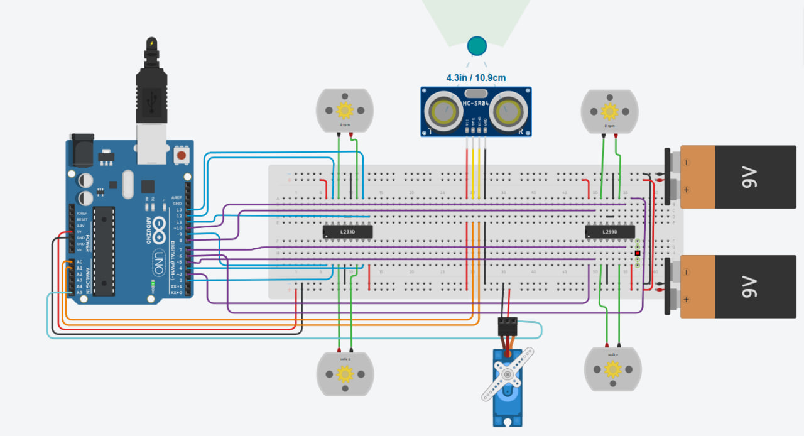

# MotorCircuit-ObstacleAvoidance

This project showcases a smart obstacle-avoiding robot built in Tinkercad using four DC motors controlled by an L293D driver, an ultrasonic sensor, and a servo motor. The robot moves forward, scans for obstacles within 10 cm, then stops, moves back, scans left and right, and turns toward the clearer path. It resumes moving forward based on sensor readings. This simulation demonstrates multi-motor control, sensor integration, and decision-making with Arduino.

---
## 📷 Screenshot


---

## 📌 Overview

When powered on, the robot moves forward. If an obstacle is detected within 10 cm, the robot stops, moves backward, and uses the servo motor to rotate the ultrasonic sensor to scan both right and left directions. Based on the measured distances, it chooses the clearer path and resumes moving forward.

---

## 🧩 Components Used

| Component               | Quantity |
|-------------------------|----------|
| Arduino UNO             | 1        |
| L293D Motor Driver      | 2        |
| DC Motors               | 4        |
| Servo Motor             | 1        |
| Ultrasonic Sensor (HC-SR04) | 1    |
| Power Supply (2 Batteries) | 2    |
| Jumper Wires            | as needed |

---

## 🪛 Wiring Summary

- Motors connected to PWM pins (D3, D6, D9, D11) and controlled using L293D outputs.
- Ultrasonic Sensor connected to A0 (Echo) and A1 (Trig).
- Servo Motor connected to A5.
- All pins are configured as OUTPUT or INPUT in the setup.


---

## 📂 Included Files

| File Name                        | Description                                 |
|----------------------------------|---------------------------------------------|
| screenshot-MotorCircuit.jpg    | Screenshot of the circuit in Tinkercad      |
| MotorCircuit-ObstacleAvoidance.ino | Full Arduino code                         |

---

## 🧠 Arduino Code

```cpp
#include <Servo.h>

Servo myservo;

int servopin = A5;
int trigpin = A1;
int echopin = A0;

int speedpin1 = 3;
int dir1 = 5;
int dir2 = 7;

int speedpin2 = 6;
int dir3 = 8;
int dir4 = 10;

int speedpin3 = 9;
int dir5 = 2;
int dir6 = 4;

int speedpin4 = 11;
int dir7 = 12;
int dir8 = 13;

void setup() {
  Serial.begin(9600);
  myservo.attach(servopin);
  myservo.write(90);
  delay(3000);

  pinMode(trigpin, OUTPUT);
  pinMode(echopin, INPUT);

  pinMode(speedpin1, OUTPUT);
  pinMode(speedpin2, OUTPUT);
  pinMode(speedpin3, OUTPUT);
  pinMode(speedpin4, OUTPUT);

  pinMode(dir1, OUTPUT);
  pinMode(dir2, OUTPUT);
  pinMode(dir3, OUTPUT);
  pinMode(dir4, OUTPUT);
  pinMode(dir5, OUTPUT);
  pinMode(dir6, OUTPUT);
  pinMode(dir7, OUTPUT);
  pinMode(dir8, OUTPUT);
}

void loop() {
  int distance = getDistance();

  if (distance <= 10) {
    stopMotors();
    delay(500);

    back();
    delay(1500);

    stopMotors();
    delay(500);

    int rightDist = scanRight();
    int leftDist = scanLeft();

    if (rightDist > leftDist) {
      turnRight();
    } else {
      turnLeft();
    }

    forward();
  } else {
    forward();
  }

  delay(100);
}

int getDistance() {
  digitalWrite(trigpin, LOW);
  delayMicroseconds(5);
  digitalWrite(trigpin, HIGH);
  delayMicroseconds(10);
  digitalWrite(trigpin, LOW);

  long duration = pulseIn(echopin, HIGH);
  return duration * 0.034 / 2;
}

void forward() {
  digitalWrite(dir1, HIGH); digitalWrite(dir2, LOW); analogWrite(speedpin1, 255);
  digitalWrite(dir3, LOW);  digitalWrite(dir4, HIGH); analogWrite(speedpin2, 255);
  digitalWrite(dir5, HIGH); digitalWrite(dir6, LOW); analogWrite(speedpin3, 255);
  digitalWrite(dir7, LOW);  digitalWrite(dir8, HIGH); analogWrite(speedpin4, 255);
}

void back() {
  digitalWrite(dir1, LOW); digitalWrite(dir2, HIGH); analogWrite(speedpin1, 255);
  digitalWrite(dir3, HIGH); digitalWrite(dir4, LOW); analogWrite(speedpin2, 255);
  digitalWrite(dir5, LOW); digitalWrite(dir6, HIGH); analogWrite(speedpin3, 255);
  digitalWrite(dir7, HIGH); digitalWrite(dir8, LOW); analogWrite(speedpin4, 255);
}

void stopMotors() {
  digitalWrite(dir1, LOW); digitalWrite(dir2, LOW);
  digitalWrite(dir3, LOW); digitalWrite(dir4, LOW);
  digitalWrite(dir5, LOW); digitalWrite(dir6, LOW);

digitalWrite(dir7, LOW); digitalWrite(dir8, LOW);

  analogWrite(speedpin1, 0);
  analogWrite(speedpin2, 0);
  analogWrite(speedpin3, 0);
  analogWrite(speedpin4, 0);
}

int scanRight() {
  myservo.write(15);
  delay(700);
  int d = getDistance();
  myservo.write(90);
  delay(300);
  return d;
}

int scanLeft() {
  myservo.write(165);
  delay(700);
  int d = getDistance();
  myservo.write(90);
  delay(300);
  return d;
}

void turnRight() {
  digitalWrite(dir1, LOW); digitalWrite(dir2, HIGH); analogWrite(speedpin1, 255);
  digitalWrite(dir3, HIGH); digitalWrite(dir4, LOW); analogWrite(speedpin2, 255);
  digitalWrite(dir5, HIGH); digitalWrite(dir6, LOW); analogWrite(speedpin3, 255);
  digitalWrite(dir7, LOW); digitalWrite(dir8, HIGH); analogWrite(speedpin4, 255);
  delay(1000);
  stopMotors();
}

void turnLeft() {
  digitalWrite(dir1, HIGH); digitalWrite(dir2, LOW); analogWrite(speedpin1, 255);
  digitalWrite(dir3, LOW); digitalWrite(dir4, HIGH); analogWrite(speedpin2, 255);
  digitalWrite(dir5, LOW); digitalWrite(dir6, HIGH); analogWrite(speedpin3, 255);
  digitalWrite(dir7, HIGH); digitalWrite(dir8, LOW); analogWrite(speedpin4, 255);
  delay(1000);
  stopMotors();
}
